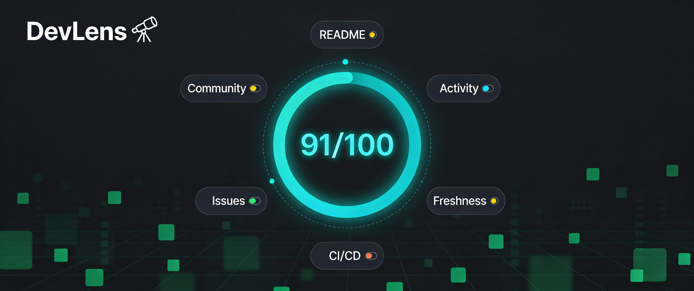

<div align="center">


<a href="https://github.com/marketplace/actions/devlens-repo-health"></a>


# 🔭 DevLens Repo Health



**The GitHub Action that gives your repo a health score, auto-updates your README,  
and sends a weekly dev analytics digest — 100% free, forever.**

[Install in 30s](#-quick-start) · [GitHub Marketplace](https://github.com/marketplace/actions/devlens-repo-health) · [💛 Sponsor](https://github.com/sponsors/SamoTech)

</div>

<!-- DEVLENS:START -->
 The health of SamoTech/devlens is at 92%.
<!-- DEVLENS:END -->

---

## ✨ What DevLens Does

| Feature | Description | Free |
|---|---|---|
| 🏥 **Health Score** | 0–100 score across 7 dimensions | ✅ |
| 📝 **AI README Update** | Injects live health badge on every push | ✅ |
| 📊 **Analytics Badge** | shields.io badge auto-generated | ✅ |
| 📬 **Weekly Digest** | Discord report every Monday 8am UTC | ✅ |
| 🤖 **AI Insights** | Groq-powered suggestions (free key) | ✅ |
| ♾️ **Unlimited Repos** | No seat limits, no per-repo pricing | ✅ |

> **vs. Code Climate ($37/dev) · LinearB ($49/dev) · GitClear ($15/dev)**  
> DevLens is 100% free, runs inside GitHub Actions, zero vendor lock-in.

---

## 📊 Health Score Dimensions

```
README Quality    ████████░░  20%  — length, sections, badges, code blocks
Commit Activity   ████████░░  20%  — push frequency last 90 days
Repo Freshness    ██████░░░░  15%  — days since last push
Documentation     ██████░░░░  15%  — LICENSE, CONTRIBUTING, CHANGELOG, etc.
CI/CD Setup       ██████░░░░  15%  — GitHub Actions workflows present
Issue Response    ████░░░░░░  10%  — closed vs open issue ratio
Community Signal  ██░░░░░░░░   5%  — stars, forks, watchers
```

---

## ⚡ Quick Start

### Step 1 — Add markers to your README

Paste this anywhere in your `README.md` where you want the live health badge to appear:

```markdown
<!-- DEVLENS:START -->
 The health of SamoTech/devlens is at 92%.
<!-- DEVLENS:END -->
```

> ⚠️ DevLens injects the health section **between these two markers**. Without them, nothing will be written to your README.

---

### Step 2 — Add the workflow

Create `.github/workflows/devlens.yml` in your repo:

```yaml
name: DevLens Health Check

on:
  push:
    branches: [main, master]
  schedule:
    - cron: '0 8 * * 1'   # Weekly Monday digest

permissions:
  contents: write

jobs:
  devlens:
    runs-on: ubuntu-latest
    steps:
      - uses: actions/checkout@v4
      - uses: SamoTech/devlens@v1
        with:
          github_token: ${{ secrets.GITHUB_TOKEN }}
          groq_api_key: ${{ secrets.GROQ_API_KEY }}    # optional — free at console.groq.com
          groq_model: 'llama-3.1-8b-instant'           # optional — override Groq model
          notify_discord: ${{ secrets.DISCORD_WEBHOOK }} # optional
```

---

### Step 3 — Add secrets (optional but recommended)

| Secret | Where to get it | Why |
|---|---|---|
| `GROQ_API_KEY` | [console.groq.com/keys](https://console.groq.com/keys) | Enables AI-written README insights |
| `DISCORD_WEBHOOK` | Discord channel → Edit → Integrations → Webhooks | Weekly digest to your team |

Add secrets at: **`your-repo` → Settings → Secrets and variables → Actions → New repository secret**

> ✅ `GITHUB_TOKEN` is automatic — no setup needed.

---

On the next push, DevLens will:
1. Score your repo across 7 dimensions
2. Auto-commit a live health badge into your README between the `<!-- DEVLENS:START -->` markers
3. Send a rich Discord embed (if webhook configured)

---

## 🔧 Inputs

| Input | Required | Default | Description |
|---|---|---|---|
| `github_token` | ✅ | — | `${{ secrets.GITHUB_TOKEN }}` |
| `groq_api_key` | ❌ | `""` | Free Groq key for AI README insights |
| `groq_model` | ❌ | `llama-3.1-8b-instant` | Groq model ID (must be enabled in your Groq project) |
| `badge_style` | ❌ | `flat` | `flat`, `flat-square`, `for-the-badge` |
| `update_readme` | ❌ | `true` | Auto-inject health badge into README |
| `notify_discord` | ❌ | `""` | Discord webhook URL for weekly digest |

## 📤 Outputs

| Output | Description |
|---|---|
| `health_score` | Integer 0–100 |
| `badge_url` | Ready-to-embed shields.io URL |
| `report_json` | Full JSON of all dimension scores |

---

## 🛣️ Roadmap

- [x] 7-dimension health score engine
- [x] Auto README badge injection
- [x] Weekly Discord digest
- [x] AI README insights (Groq/Llama 3)
- [ ] Web dashboard (Next.js)
- [ ] Email digest (Resend free tier)
- [ ] PR quality scoring
- [ ] Historical trend charts
- [ ] Multi-repo portfolio view
- [ ] Slack integration

---

## 💛 Sponsor DevLens

DevLens is — and always will be — **completely free**. No trials. No paywalls. No "Pro" tier.

If DevLens saves you time, helps your team, or just makes your repos look sharp —  
and you want to say thanks — a sponsorship means the world and keeps this project alive.

> No pressure. No subscription. Just love. 🙏

**[→ Sponsor on GitHub](https://github.com/sponsors/SamoTech)**

---

## 🤝 Contributing

See [CONTRIBUTING.md](CONTRIBUTING.md). PRs welcome!

---

## 📄 License

MIT © [SamoTech](https://github.com/SamoTech)

---

<div align="center">
  <sub>Built with GitHub Actions + Groq + ☕ by SamoTech<br/>
  Free forever. If it helped you, <a href="https://github.com/sponsors/SamoTech">a small sponsorship</a> keeps the lights on. 💛</sub>
</div>
