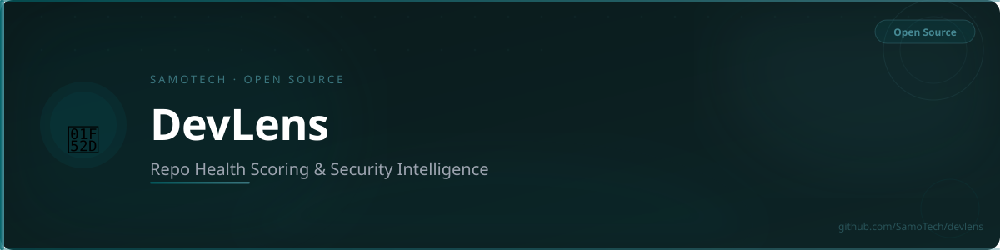

<div align="center">




# 🔭 DevLens

**A GitHub Action that scores a repository in 9 dimensions and writes the result directly into its README.**

No dashboard. No hosted database. No account required. The repository being scored is the user's own GitHub repository, identified automatically by `github.repository`.

</div>

---


## What DevLens does

Add one GitHub Actions workflow to your repository.

DevLens then:

1. Reads the repository directly through the GitHub API.
2. Calculates a transparent 0–100 score across 9 dimensions.
3. Publishes the score in the GitHub Actions job summary.
4. Exposes `health_score`, `badge_url`, and the complete `report_json` as Action outputs.
5. Optionally writes the current score and dimension table between `DEVLENS:START` / `DEVLENS:END` markers in your README.
6. Can fail CI when the repository falls below a threshold you choose.

The Action scores **the repository where it is installed**. There is no separate DevLens web application involved.

## 9 dimensions

| Dimension | Weight |
|---|---:|
| 📝 README Quality | 20% |
| 🔥 Commit Activity | 20% |
| 🌿 Repo Freshness | 10% |
| 📚 Documentation | 10% |
| ⚙️ CI/CD Setup | 10% |
| 🎯 Issue Response | 10% |
| ⭐ Community Signal | 5% |
| 🔀 PR Velocity | 10% |
| 🔐 Security | 5% |

The weighted result is bounded to 0–100. DevLens does not artificially force a repository to 100.

## Install

Create:

`.github/workflows/devlens.yml`

```yaml
name: DevLens

on:
  push:
    branches: [main, master]
  workflow_dispatch:

permissions:
  contents: write
  security-events: read

jobs:
  health:
    runs-on: ubuntu-latest
    steps:
      - name: Score repository
        uses: SamoTech/devlens@v2
        with:
          github_token: ${{ secrets.GITHUB_TOKEN }}
          update_readme: 'true'
          readme_branch: ''
          badge_style: flat-square
```

Commit the workflow and GitHub Actions will run DevLens against that repository.

For public repositories, the standard `GITHUB_TOKEN` is sufficient for normal scoring. The workflow should grant only the permissions it needs; `contents: write` is required when `update_readme: true`, while `security-events: read` enables security-related API checks.

## README result

DevLens maintains this block automatically:

```markdown
<!-- DEVLENS:START -->
...current score and dimension report...
<!-- DEVLENS:END -->
```

Only the content between the markers is replaced. If the markers do not exist, DevLens appends them.

## Inputs

| Input | Required | Default | Description |
|---|---|---|---|
| `github_token` | Yes | — | GitHub token used for repository inspection |
| `update_readme` | No | `true` | Write the score report to README |
| `readme_branch` | No | empty | Branch to update; empty uses the repository default branch |
| `badge_style` | No | `flat` | Shields.io badge style |
| `fail_on_score_below` | No | empty | Fail the Action below this 0–100 score |
| `notify_discord` | No | empty | Optional Discord webhook |

## Outputs

| Output | Description |
|---|---|
| `health_score` | Overall score from 0 to 100 |
| `badge_url` | Shields.io badge URL for the current score |
| `report_json` | Machine-readable report containing all nine dimensions |

## CI quality gate

```yaml
- uses: SamoTech/devlens@v2
  with:
    github_token: ${{ secrets.GITHUB_TOKEN }}
    update_readme: 'true'
    fail_on_score_below: '80'
```

## Versioning

Production workflows should use `@v2`, not `@main`. Pin to a specific release tag or full commit SHA when you require immutable supply-chain control.

## Runtime dependencies

The Action installs its direct Python dependencies from the repository's pinned `requirements.txt` rather than resolving unpinned packages at runtime.

## Testing

DevLens has two validation layers:

- Static validation compiles the scorer and validates the Action metadata.
- Live integration executes the actual composite Action against GitHub's API and validates its outputs and all nine dimensions.

README persistence is also testable without mutating the production branch by setting `readme_branch` to a disposable test branch.

Release automation runs a live Action preflight before creating the versioned tag and refuses to overwrite an existing versioned release tag.

## Marketplace\n\nDevLens is a single public GitHub Action repository with `action.yml` at the root.\n\nGitHub Marketplace publication is tied to a semantic GitHub release. For v2, the release target is:\n\n- Versioned release: `v2.0.0`\n- Consumer tag: `v2`\n- Marketplace action: **DevLens Repo Health**\n- Marketplace categories: **Code quality** and **Utilities**\n\nAfter the release workflow creates the GitHub release, the release must be published to the GitHub Marketplace using GitHub's **Publish this Action to the GitHub Marketplace** option. This requires the repository owner's acceptance of the GitHub Marketplace Developer Agreement. The existing Marketplace listing is updated by publishing the new release; no PyPI package or DevLens account is required.\n\nFor production workflows, install:\n\n```yaml\n- uses: SamoTech/devlens@v2\n  with:\n    github_token: ${{ secrets.GITHUB_TOKEN }}\n```\n\n## AI agent project instructions

AI agents working on this repository must start by reading this `README.md`, then read the authoritative master project document:

`docs/AI_PROJECT_CONTEXT.md`

That document is the project's master source of truth for product direction, architecture, decisions, roadmap, current state, testing rules, and AI-agent operating rules.

AI agents must:

1. Read `README.md` first.
2. Read `docs/AI_PROJECT_CONTEXT.md` before making project-level decisions or implementation changes.
3. Inspect the current repository state and relevant source/workflows.
4. Build their working task prompt from the documented objective, constraints, and acceptance criteria.
5. Follow the documented product boundary and do not reintroduce removed architecture.
6. Verify their work with appropriate tests and real workflow evidence where applicable.
7. Update the project documentation whenever their work changes behavior, architecture, decisions, roadmap, testing, security, or project state.
8. Leave the documentation accurate for the next AI agent.

**Documentation is part of the implementation. If the code and project documentation disagree, investigate and restore consistency rather than silently choosing one.**
