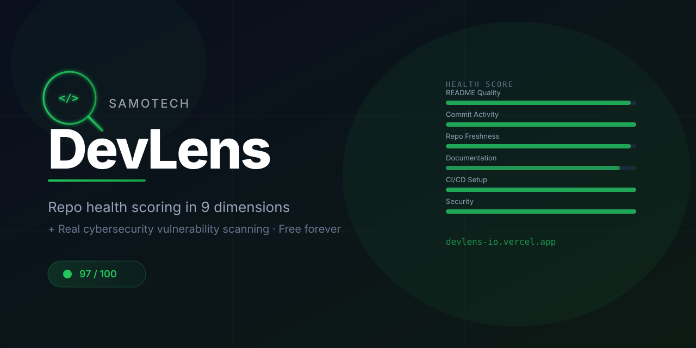

<div align="center">




# 🔭 DevLens

**A GitHub Action that scores a repository in 9 dimensions and writes the result directly into its README.**

No dashboard. No hosted database. No account required. The repository being scored is the user's own GitHub repository, identified automatically by `github.repository`.

</div>

---

<!-- DEVLENS:START -->
> Add the workflow below to score this repository and let DevLens maintain this block automatically.
<!-- DEVLENS:END -->

## What DevLens does

Add one GitHub Actions workflow to your repository.

DevLens then:

1. Reads the repository directly through the GitHub API.
2. Calculates a transparent 0–100 score across 9 dimensions.
3. Publishes the score in the GitHub Actions job summary.
4. Exposes `health_score`, `badge_url`, and the complete `report_json` as Action outputs.
5. Optionally writes the current score and dimension table between `DEVLENS:START` / `DEVLENS:END` markers in your README.
6. Can fail CI when the repository falls below a threshold you choose.

The Action scores **the repository where it is installed**. There is no separate DevLens web application involved.

## 9 dimensions

| Dimension | Weight |
|---|---:|
| 📝 README Quality | 20% |
| 🔥 Commit Activity | 20% |
| 🌿 Repo Freshness | 10% |
| 📚 Documentation | 10% |
| ⚙️ CI/CD Setup | 10% |
| 🎯 Issue Response | 10% |
| ⭐ Community Signal | 5% |
| 🔀 PR Velocity | 10% |
| 🔐 Security | 5% |

The weighted result is bounded to 0–100. DevLens does not artificially force a repository to 100.

## Install

Create:

`.github/workflows/devlens.yml`

```yaml
name: DevLens

on:
  push:
    branches: [main, master]
  workflow_dispatch:

permissions:
  contents: write
  security-events: read

jobs:
  health:
    runs-on: ubuntu-latest
    steps:
      - name: Score repository
        uses: SamoTech/devlens@main
        with:
          github_token: ${{ secrets.GITHUB_TOKEN }}
          update_readme: 'true'
          badge_style: flat-square
```

Commit the workflow and GitHub Actions will run DevLens against that repository.

For public repositories, the standard `GITHUB_TOKEN` is sufficient for normal scoring. Security checks may require the repository's available GitHub security permissions.

## README result

DevLens maintains this block automatically:

```markdown
<!-- DEVLENS:START -->
...current score and dimension report...
<!-- DEVLENS:END -->
```

A typical result looks like:

```text
DevLens Health: 87/100

README Quality    76
Commit Activity   100
Repo Freshness    100
Documentation     96
CI/CD Setup       100
Issue Response    94
Community Signal  16
PR Velocity       85
Security          70
```

The README is the persistent result. No DevLens account or hosted storage is required.

## CI gating

Use `fail_on_score_below` when the score should be a real quality gate:

```yaml
- name: Score repository
  uses: SamoTech/devlens@main
  with:
    github_token: ${{ secrets.GITHUB_TOKEN }}
    update_readme: 'true'
    fail_on_score_below: '80'
```

This lets teams enforce their own minimum repository-health threshold.

## Action outputs

The Action exposes:

- `health_score` — integer from 0 to 100.
- `badge_url` — Shields.io badge URL.
- `report_json` — complete machine-readable 9-dimension report.

Example:

```yaml
- name: Score repository
  id: devlens
  uses: SamoTech/devlens@main
  with:
    github_token: ${{ secrets.GITHUB_TOKEN }}

- name: Use DevLens score
  run: |
    echo "Repository health: ${{ steps.devlens.outputs.health_score }}/100"
```

## Real integration testing

DevLens itself tests the actual Action against GitHub's live API in CI. The integration workflow executes the same composite Action a user installs, validates the outputs, and verifies that the score is a real 0–100 result.

This is deliberately different from unit-only tests: the Action must successfully authenticate to GitHub, inspect a real repository, calculate all nine dimensions, and produce its outputs.

## Design principles

DevLens is intentionally GitHub-native:

- GitHub Actions is the execution platform.
- GitHub API is the data source.
- README is the persistent score surface.
- GitHub Actions job summaries provide the execution report.
- Action outputs provide machine-readable integration points.
- There is no hosted dashboard.
- There is no required DevLens account.
- There is no required Redis/database.
- There is no Vercel dependency.

## Development

The core implementation is:

```text
action.yml
scripts/devlens.py
```

Validate the Python Action locally:

```bash
python -m py_compile scripts/devlens.py
```

The production behavior is exercised by the GitHub Actions integration workflow.

## License

MIT
